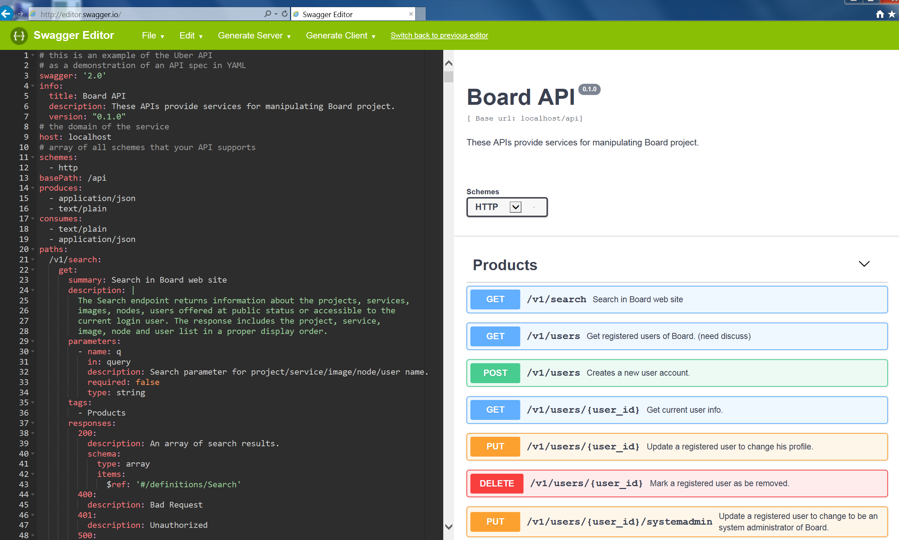
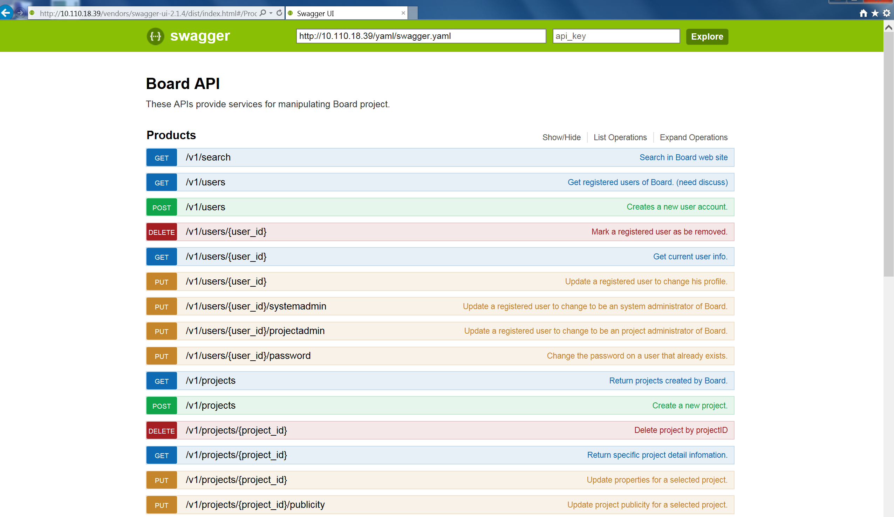

# View and test Board REST API via Swagger
A Swagger file is provided for viewing and testing Board REST API. First, you should get the source code of Board:
```sh
   git clone http://10.110.18.40:10080/inspursoft/board.git
```
### Viewing Board REST APIBoard
* Open the file **swagger.yaml** under the _docs_ directory in Board project;
* Paste all its content into the online Swagger Editor at http://editor.swagger.io. The descriptions of Board API will be shown on the right pane of the page.



### Testing Board REST API
From time to time, you may need to mannually test Board REST API. You can deploy the Swagger file into Board's service node. 

**Caution:** When using Swagger to send REST requests to Board, you may alter the data of Board accidentally. For this reason, it is NOT recommended using Swagger against a production Board instance.

* Change the directory to _tools/swagger_ in Board project.

```sh
  cd tools
```
* Edit the script file _prepare-swagger.sh_ under the _tools/swagger_ directory.

```sh
  vi prepare-swagger.sh
```
* Change the SCHEME to the protocol scheme of your Board server.

```sh
  SCHEME=<BOARD_SERVER_SCHEME>
```
* Change the SERVER_IP to the IP address of your Board server.

```sh
  SERVER_IP=<BOARD_SERVER_DOMAIN>
```
* Run the shell script. It downloads a Swagger package and extracts files into the _static_ directory in Board project and pull httpd cotainer for REST API review. 

```sh
   ./prepare-swagger.sh
```

* Enter the URL of the Swagger page in Board as below. The ```<BOARD_SERVER>``` should be replaced by the IP address or the hostname of the Board server. If you setup Swagger after ApiServer started, you should restart ApiServer after configured it.

```
  http://<BOARD_SERVER>/index.html
```
* You should see a Swagger UI page with Board API _swagger.yaml_ file loaded in the same domain, **be aware that your REST request submitted by Swagger may change the data of Board**.


